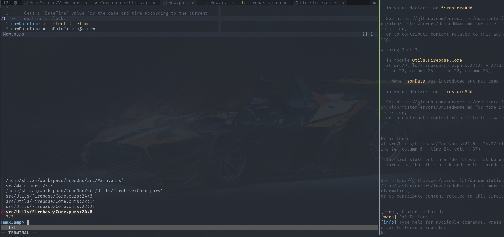

# tmuxjump.vim

A plugin to open file from file paths printed in sibling tmux pane. 

## Install

### Dependencies

This plugin is dependent on following
- [Fzf.vim](https://github.com/junegunn/fzf.vim)
- [tmux](https://github.com/tmux/tmux/wiki)

### Installation

Use your favorite plugin manager.

Using [vim-plug](https://github.com/junegunn/vim-plug):

  `Plug 'shivamashtikar/tmuxjump.vim'`

Using [vundle](https://github.com/gmarik/Vundle.vim):

  `Plugin 'shivamashtikar/tmuxjump.vim'`

Using [neobundle](https://github.com/Shougo/neobundle.vim):

  `NeoBundle 'shivamashtikar/tmuxjump.vim'`

With [pathogen.vim](https://github.com/tpope/vim-pathogen), just clone this repository inside `~/.vim/bundle`:

### Configuration

Map a keybinding to trigger plugin

  `nmap <leader>ft :TmuxJumpFile<CR>`

